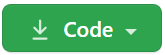
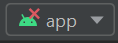
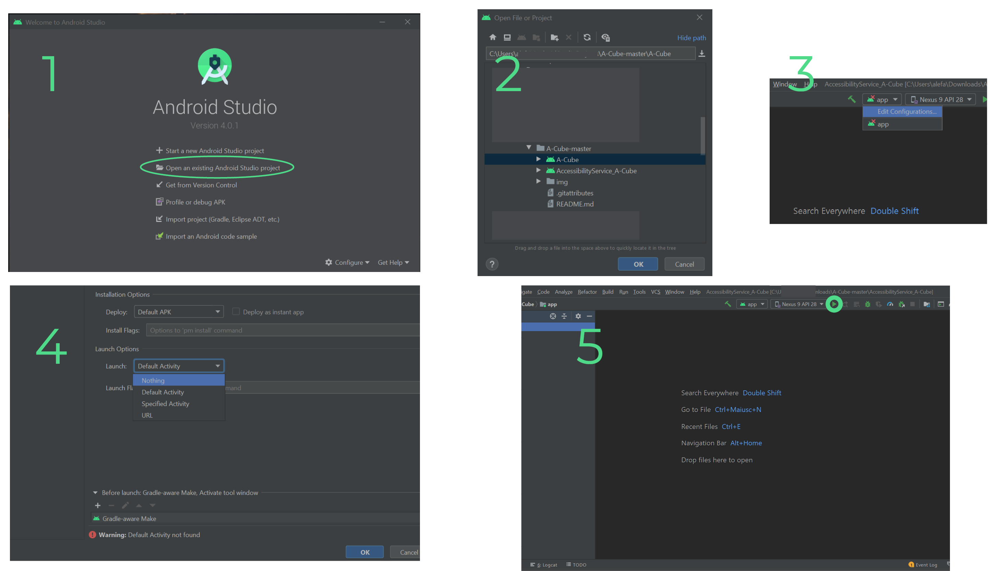

# RePlay #
RePlay is a system who improve videogames's accessibility on mobile devices, the old name of this system was *A-Cube* (much of the code still uses this old name).  
The idea is to be able to simulate the action that the user intends to do by intercepting this what does it do.
In order to generate an event starting from the user's action, it is necessary to know two things:
* know what are the interaction tools that the user uses (peripherals external input or voice commands) and what are the actions it can perform with such tools
* know which are the events of the games that it is possible to generate (meaning where on the screen is it possible to have an interaction with the graphic elements).      

RePlay is composed by an Accessibility Service (*AccessibilityService_A-Cube*) and a configuration app (*A-Cube*).  
The configuration app stores the objects we're going to describe below in the Downloads folder of the mobile device where it's installed.
The main data structures are **Actions**, **Events**, **Games**, **Links**, **SVM Models** and **Configurations**.  
#### Actions ####
Actions are the input commands through which it is possible activate Events, they are composed by:  
  * **Name**, the name who identify the specific action (for example Vocal A or Button B).  
  * **Type**, it specify the action type that can be *Button* or *Vocal*.   

#### Events ####
Events are objects capable of emulating interactions with the touch screen of mobile devices, they are composed by:
  * **Name**, identifies uniquely the Event with respect to the game it is associated with.  
  * **Type**, represents the type of gesture to emulate.
  * **Coordinates**, indicate where on the screen the Event will be performed.  
  * **Screenshot**, represents the game screen where we want to run the Event.  
  * **Portrait**, indicates whether you are playing the game in Portrait or Landscape.  
  
#### Games ####
Games are references to games installed inside our device, they are composed by:  
  * **Bundle-id**, name of the game package that identifies it uniquely within RePlay.  
  * **Title**, game title, is shown inside RePlay to identify the game.  
  * **Icon**, game icon, is shown inside RePlay to identify the game.   
  * **Events**, the list of events associated with this game.  

#### Links ####
Links are objects that relate Actions to Events. When the Action is performed, the defined gesture is generated from the associated event. They are composed by:  
  * **Action name**, reference to a registered action.  
  * **Event name**, reference to a registered event.    
  * **Marker size**, size of the marker used to define the point on the screen where the user wants the event to be executed the event.      
  * **Marker color**, color of the marker just mentioned above.  
  
#### SVM Models #### 
SVM Models are references to models created using the Support Vector Machines (SVM) classifier. These models allow the recognition of vocal commands. They are composed by:  
  * **Name**, uniquely identifies the SVM Models inside RePlay.  
  * **Sounds**, names of the Vocal Actions that the model is capable of recognize.  
  
#### Configurations ####  
Configurations are containers that serve to group Links according to a logical scheme. For example we can create two Configurations for the same game: the first containing
Voice actions and the second containing Button actions that activate both the same Events. They are composed by:  
  * **Name**, is the name of the Configuration, two Configurations cannot exist with the same name associated with the same game.   
  * **Bundle-ID**,indicates which game the Configuration refers to.
  * **SVM Model**, SVM Model name used in this Configuration.    
  * **Selected**, value that indicates which Configuration it is active.  
  * **Links**, the list of Links contained in this Configuration.  
  
# Instructions for testing the code #  
## Install from Android Studio ##
First of all click on the  button, then on "Download ZIP" to download the repo's zip. Then go to the folder where you downloaded the zip, right click and extract to *"A-Cube-master"*.  
Now open Android Studio and click on **"Open an existing Android Studio project"** or **"File -> Open.. -> A-Cube-master -> A-Cube -> OK"** and wait until gradle sync, etc.. are done.  
Make the same thing on a new Android Studio window for the *AccessibilityService_A-Cube* **"File -> Open.. -> A-Cube-master -> AccessibilityService_A-Cube -> OK"**.  
When you open the Accessibility Service's file you will see this icon      on the top center of the window, click on it and then on "*Edit Configurations*". In Launch Options click on **Default Activity** and then select **Nothing**, confirm with "**OK**". Now click on the "Run" button to install the Accessibility Service on your device (you will see this in Accessibility Settings -> Installed services).  
`N.B. In some cases the same procedure must also be done for the *"A-Cube"* file, for this you will have to manually launch the app from your device.`  

  

## Demo ##
Launch the app *A-Cube* , grant permissions and in the "*GAMES* section tap the add button on the bottom-right of the screen to add a game.  
`N.B. sometimes the app may crash on first launch, grant permissions anyway and reopen the app.`  

Now go to the "*ACTIONS*" section and tap the add button to add a new Configuration, select the type of Configuration (Vocal or Buttons), choose a name for the Action and then (in case you had choose Vocal Action) tap the bottom-center button "*NUOVO COMANDO VOCALE*". Now tap the button "*REC*" to start recording the voice command, speak a voice sound you want to use in the game.  
Before associating the newly created Configuration to the inserted game, open the game and take a screenshot of the screen you will have to interact with.  

Now turn back into the Configuration app tap on the game in the "*GAMES*" section, tap the add button to insert a new Configuration, choose a name, press "*SALVA*" and then tap the newly added configuration. Tap the add button to add an Event, choose: a name, the type (the gesture we want reproduce by our voice sound), the Action (the configuration we saved first); then tap the grey rectangle with the camera icon to add the game screenshot, tap a point where you want to reproduce the gesture, choose a size and a color for the marker on the screenshot and finally tap the "*SAVE*" button on the bottom-right to save.  

Now that we have the configuration we need to update the voice recognition, so tap on the button "*AGGIORNA IL RICONOSCIMENTO VOCALE*" and wait until model training is completed.

